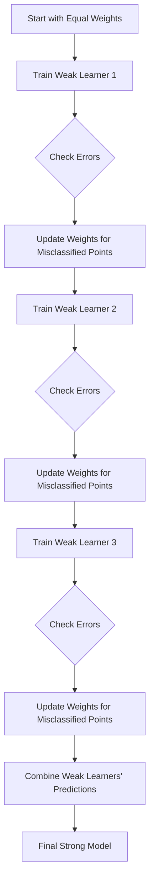

---
{"dg-publish":true,"permalink":"/ada-boost/","tags":["trees","boosting","ensemble-learning"],"noteIcon":"2","updated":"2024-05-23T17:52:55.026+05:30"}
---

AdaBoost, short for Adaptive Boosting, is a technique that combines multiple weak learners (simple models) to create a strong overall model. Here’s how it works in simple steps:

1. **Start with Equal Weights**: All data points are initially given equal importance (weight).
2. **Train a Weak Learner**: Train a simple model (like a decision stump) on the data.
3. **Calculate Errors**: See which data points are misclassified by the model.
4. **Update Weights**: Increase the weights of the misclassified data points so that the next model focuses more on them.
5. **Repeat**: Train another weak learner on the updated weights and repeat the process.
6. **Combine Models**: The final prediction is a weighted vote of all the weak learners.

## Step-by-Step Mermaid Diagram

### Detailed Steps in the Diagram

1. **Start with Equal Weights**: All data points are equally important at the beginning.
2. **Train Weak Learner 1**: Train the first weak model on the entire dataset.
3. **Check Errors**: Identify which data points were misclassified.
4. **Update Weights for Misclassified Points**: Increase the importance of the misclassified points.
5. **Train Weak Learner 2**: Train the second weak model with updated weights.
6. **Check Errors**: Identify misclassified points by the second model.
7. **Update Weights for Misclassified Points**: Again, increase the importance of the misclassified points.
8. **Train Weak Learner 3**: Train the third weak model with the latest weights.
9. **Check Errors**: Identify misclassified points by the third model.
10. **Update Weights for Misclassified Points**: Increase the importance of the misclassified points.
11. **Combine Weak Learners' Predictions**: Combine the predictions of all weak models, with more accurate models given more weight.
12. **Final Strong Model**: The result is a strong model that makes better predictions than any single weak learner.

<iframe title="AdaBoost, Clearly Explained" src="https://www.youtube.com/embed/LsK-xG1cLYA?start=60&amp;feature=oembed" height="113" width="200" allowfullscreen="" allow="fullscreen" style="aspect-ratio: 1.76991 / 1; width: 100%; height: 100%;"></iframe>
