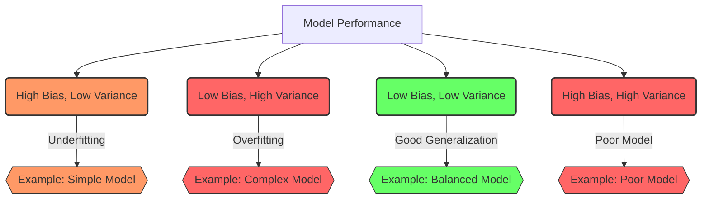

---
{"dg-publish":true,"permalink":"/bias-vs-variance/","noteIcon":"2","updated":"2024-05-22T15:41:54.951+05:30"}
---

## Bias

**Bias** refers to errors introduced by assuming that our model is simpler than the real-world problem we are trying to solve. Think of it as an archer consistently aiming at a target but always missing in the same direction because they are not accounting for the wind.

- **High bias**: The archer (or model) aims consistently but misses the target in a specific direction every time. This means the model is too simple and cannot capture the complexity of the data (underfitting).
- **Low bias**: The archer adjusts their aim better and can hit closer to the target. This means the model captures the complexity of the data more accurately.

## Variance

**Variance** refers to errors introduced because our model is too sensitive to the small fluctuations in the training data. Imagine the same archer hitting different spots all over the target every time they shoot because they are overreacting to every gust of wind.

- **High variance**: The archer's shots are spread out all over the target. This means the model is too complex and is fitting the noise in the training data (overfitting).
- **Low variance**: The archer's shots are closer together, indicating that the model is not overly sensitive to small changes in the training data.

### Balance Between Bias and Variance

The goal in machine learning is to find the right balance between bias and variance:

- **High Bias + Low Variance**: The model is simple and consistent but misses capturing the underlying patterns (underfitting).
- **Low Bias + High Variance**: The model is complex and captures too much detail, including noise (overfitting).
- **Just Right**: The model captures the underlying patterns without being overly sensitive to noise, achieving good generalization on new data.

Here's a visual analogy:

- **High Bias**: All the arrows are clustered together but far from the bullseye.
- **High Variance**: The arrows are scattered all over the target, some near the bullseye and some far.
- **Low Bias + Low Variance**: The arrows are clustered together and close to the bullseye, indicating a good model.

Balancing bias and variance is key to building models that perform well on unseen data.

---

## Resources

### Why Do We Need the Bias Term in ML Algorithms

<iframe title="Why do we need the Bias Term in Machine Learning Algorithms and Neural Networks" src="https://www.youtube.com/embed/fMAElNVN4S0?feature=oembed" height="113" width="200" allowfullscreen="" allow="fullscreen" style="aspect-ratio: 1.76991 / 1; width: 100%; height: auto;"></iframe>

---

### Bias Vs Variance

<iframe title="Machine Learning Fundamentals: Bias and Variance" src="https://www.youtube.com/embed/EuBBz3bI-aA?feature=oembed" height="113" width="200" allowfullscreen="" allow="fullscreen" style="width: 100%; height: auto; aspect-ratio: 16 / 9;"></iframe>

---

### Splitting Data into Training and Testing Sets

<iframe src="https://www.youtube.com/embed/BAiMKBrFntc?list=PLZsOBAyNTZwaQB9nUTYUYNhz7b22bAJYY" height="113" width="200" allowfullscreen="" allow="fullscreen" style="aspect-ratio: 1.76991 / 1; width: 100%; height: auto;"></iframe>

---

## What Are Some Ways We Can Reduce Overfitting?

Overfitting is a common challenge in machine learning where a model performs exceptionally well on the training data but fails to generalize to new, unseen data. To reduce overfitting, several techniques can be applied:

1. **Increase Training Data**: Obtaining more training data can help the model capture a broader representation of the underlying patterns in the data, reducing the chances of overfitting.
    
2. **Cross-Validation**: Using cross-validation techniques, such as k-fold cross-validation, helps evaluate the model's performance on multiple subsets of data, providing a more reliable estimate of its generalization ability.
    
3. **Feature Selection**: Careful selection of relevant features and removing irrelevant or noisy features can help reduce overfitting. It's important to focus on the most informative features that contribute to the predictive power of the model.
    
4. **[[Regularization\|Regularization]]**: Regularization techniques add a penalty term to the model's objective function, discouraging overly complex or extreme parameter values. Common regularization techniques include L1 regularization (Lasso) and L2 regularization (Ridge), which help constrain the model's parameters and prevent overfitting.
    
5. **Early Stopping**: Monitoring the model's performance on a validation set during training and stopping the training process when the performance starts to degrade can prevent overfitting. This approach prevents the model from continuing to improve on the training data while losing its ability to generalize.
    
6. **[[Ensemble Learning\|Ensemble Learning]]**: Ensemble methods combine multiple models to make predictions. Techniques like bagging (bootstrap aggregating) and boosting can reduce overfitting by aggregating the predictions of multiple models, thereby reducing the impact of individual models that may be prone to overfitting.
    
7. **Simplifying the Model**: Reducing the complexity of the model, such as decreasing the number of layers or nodes in a neural network, or reducing the maximum depth of a decision tree, can help prevent overfitting. Simplifying the model reduces its capacity to memorize noise or irrelevant patterns in the data.
    
8. **Dropout**: Dropout is a regularization technique commonly used in neural networks. It randomly drops out a fraction of the nodes or connections during training, forcing the network to learn more robust and generalizable features.
    

These techniques, alone or in combination, can help mitigate overfitting and improve the model's ability to generalize well to unseen data. It's important to strike a balance between model complexity and the amount of available data to achieve the best trade-off between underfitting and overfitting.
