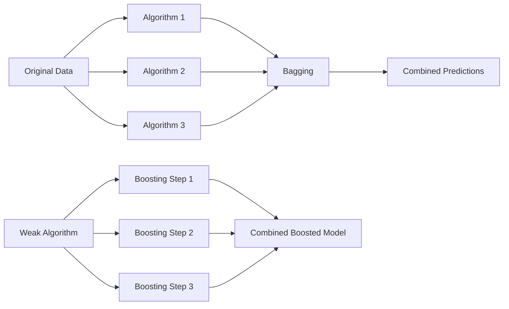

---
{"dg-publish":true,"permalink":"/ensemble-learning/","tags":["bagging","boosting","ensemble-learning"],"noteIcon":"2","updated":"2024-05-23T17:08:45.324+05:30"}
---

Ensemble learning is like teamwork for algorithms. Instead of relying on just one algorithm to make predictions, ensemble learning combines multiple algorithms together to improve accuracy and make more reliable predictions.

**Bagging** is a type of ensemble learning where multiple copies of the same algorithm are trained on different random subsets of the data (***bootstrapping***). Each copy learns something slightly different, and then their predictions are combined to make a final decision. It's like asking multiple experts to give their opinions, and then taking the average or most common answer.

**Boosting**, on the other hand, is a bit like learning from your mistakes. It starts with a weak algorithm and focuses on the mistakes it makes. It then trains more copies of the algorithm, each one paying extra attention to where the previous ones went wrong. This iterative process continues until the predictions become more accurate.

---

## Resources

### Bagging Vs Boosting

- Very nice intro to bagging and boosting giving an overview.
- Nice to form an intuition for getting started on ensemble models.
- *Fails to give a comprehensive understanding of bias and variance effects on both.*

<iframe title="Bagging vs Boosting - Ensemble Learning In Machine Learning Explained" src="https://www.youtube.com/embed/tjy0yL1rRRU?feature=oembed" height="113" width="200" allowfullscreen="" allow="fullscreen" style="aspect-ratio: 1.76991 / 1; width: 100%; height: auto;"></iframe>

---

### 📚 [Boosting and Bagging explained with examples !!!](https://medium.com/swlh/boosting-and-bagging-explained-with-examples-5353a36eb78d)

- Very clearly explains how boosting and bagging works with very simple examples!

---

<a class="markdown-embed-link" href="/faq/#449278" aria-label="Open link"><svg xmlns="http://www.w3.org/2000/svg" width="24" height="24" viewBox="0 0 24 24" fill="none" stroke="currentColor" stroke-width="2" stroke-linecap="round" stroke-linejoin="round" class="svg-icon lucide-link"><path d="M10 13a5 5 0 0 0 7.54.54l3-3a5 5 0 0 0-7.07-7.07l-1.72 1.71"></path><path d="M14 11a5 5 0 0 0-7.54-.54l-3 3a5 5 0 0 0 7.07 7.07l1.71-1.71"></path></svg></a>

> [!faq]- When to use Bagging vs when to use Boosting?
> ### Bagging
> - **When to use it?**
> 	- **When you have high variance**: Your model is too sensitive to the data (e.g., it changes a lot with different training data).
> 	- **When you want to reduce overfitting**: Bagging helps to make your model more stable by averaging multiple models.
> 	- **When you can train multiple models independently**: Each model can be trained in parallel.
> - **How it works?**
> 	- **Bootstrap sampling**: Create multiple subsets of the training data by sampling with replacement.
> 	- **Train multiple models**: Train a model on each subset.
> 	- **Aggregate predictions**: Combine the predictions of all models (e.g., by averaging for regression or voting for classification).
> 
> ## Boosting
> - **When to use it?**
> 	- **When you have high bias**: Your model is too simple and underfits the data.
> 	- **When you want to improve weak learners**: Boosting builds a strong model by combining many weak models.
> 	- **When you can handle sequential training**: Each model is trained based on the errors of the previous one, so they need to be trained in sequence.
> 	
> - **How it works?**
> 	- **Sequential learning**: Train a model, then adjust the training data based on the errors of that model.
> 	- **Focus on difficult cases**: Each subsequent model focuses more on the data points that were previously misclassified.
> 	- **Combine models**: Each model’s predictions are weighted based on their accuracy, and the final prediction is a combination of all models.
> 
> ## Summary
> - **Bagging**: Use when you want to reduce variance and can train models independently.
> - **Boosting**: Use when you want to reduce bias and can train models sequentially.
>
>Here's a simple analogy:
> - **Bagging**: Imagine asking several friends (independently) for their opinions on a movie and then taking the average of their scores.
> ****- **Boosting**: Imagine asking one friend for their opinion, then another friend to improve upon that opinion, and so on, until you get a refined score.

