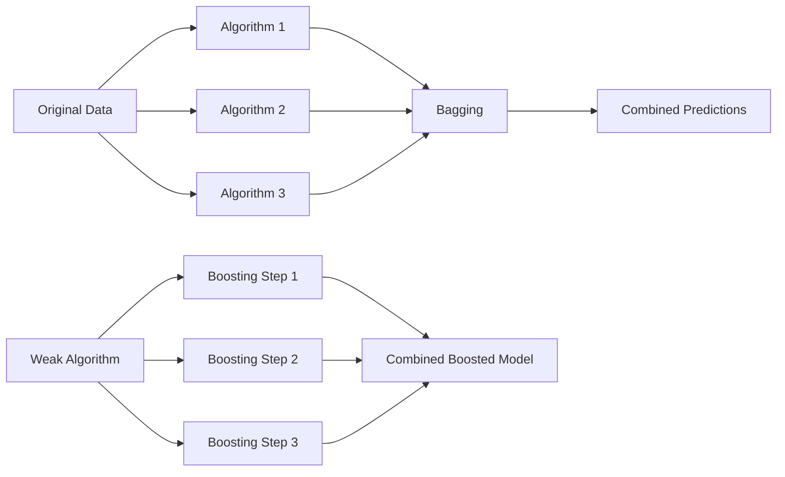

---
{"dg-publish":true,"permalink":"/ensemble-learning/"}
---

Ensemble learning is like teamwork for algorithms. Instead of relying on just one algorithm to make predictions, ensemble learning combines multiple algorithms together to improve accuracy and make more reliable predictions.

**Bagging** is a type of ensemble learning where multiple copies of the same algorithm are trained on different random subsets of the data (***bootstrapping***). Each copy learns something slightly different, and then their predictions are combined to make a final decision. It's like asking multiple experts to give their opinions, and then taking the average or most common answer.

**Boosting**, on the other hand, is a bit like learning from your mistakes. It starts with a weak algorithm and focuses on the mistakes it makes. It then trains more copies of the algorithm, each one paying extra attention to where the previous ones went wrong. This iterative process continues until the predictions become more accurate.

---

## Resources

### Bagging Vs Boosting

- Very nice intro to bagging and boosting giving an overview.
- Nice to form an intuition for getting started on ensemble models.
- *Fails to give a comprehensive understanding of bias and variance effects on both.*

<iframe title="Bagging vs Boosting - Ensemble Learning In Machine Learning Explained" src="https://www.youtube.com/embed/tjy0yL1rRRU?feature=oembed" height="113" width="200" allowfullscreen="" allow="fullscreen" style="aspect-ratio: 1.76991 / 1; width: 100%; height: auto;"></iframe>

---

### 📚 [Boosting and Bagging explained with examples !!!](https://medium.com/swlh/boosting-and-bagging-explained-with-examples-5353a36eb78d)

- Very clearly explains how boosting and bagging works with very simple examples!

---
