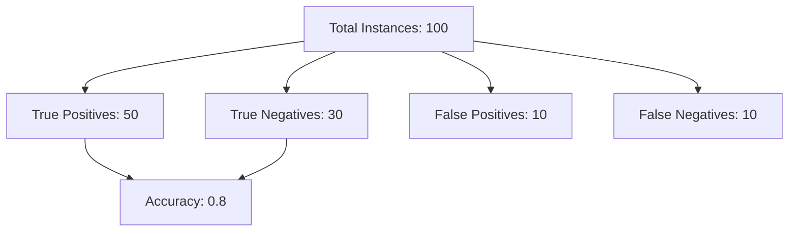
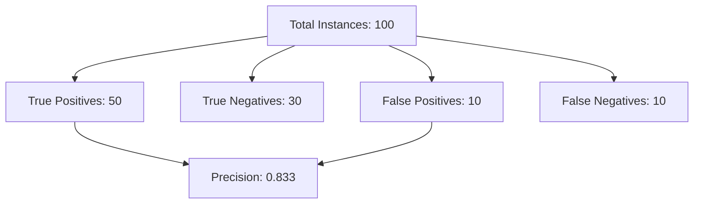
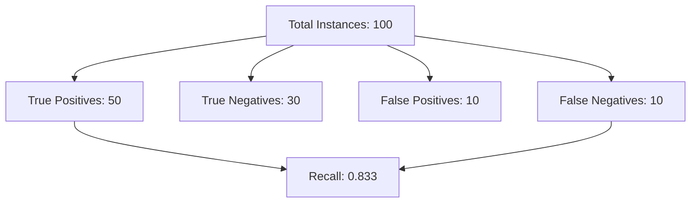
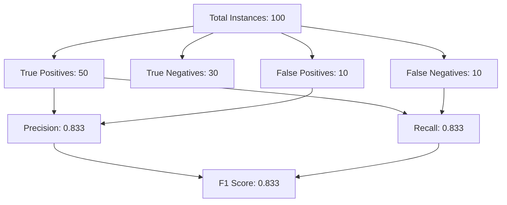

---
{"dg-publish":true,"permalink":"/evaluating-machine-learning-models/","noteIcon":"2","updated":"2024-05-22T15:30:22.897+05:30"}
---

Evaluating machine learning models involves using various metrics to understand their performance. Here are some common evaluation metrics along with simple explanations and visual examples using Mermaid diagrams.

## Evaluation Metrics

### Accuracy

Accuracy measures the proportion of correctly predicted instances out of the total instances. It is calculated as:

$$ \text{Accuracy} = \frac{\text{True Positives (TP)} + \text{True Negatives (TN)}}{\text{Total Instances}} $$

**Example:**

- True Positives (TP): 50
- True Negatives (TN): 30
- False Positives (FP): 10
- False Negatives (FN): 10
- Total Instances: 100

$$ \text{Accuracy} = \frac{50 + 30}{100} = 0.8 $$

**Mermaid Diagram:**

### Precision

Precision measures the proportion of correctly predicted positive instances out of the total predicted positive instances. It is calculated as:

$$ \text{Precision} = \frac{\text{True Positives (TP)}}{\text{True Positives (TP)} + \text{False Positives (FP)}} $$

**Example:**

- True Positives (TP): 50
- True Negatives (TN): 30
- False Positives (FP): 10
- False Negatives (FN): 10
- Total Instances: 100

$$ \text{Precision} = \frac{50}{50 + 10} = 0.833 $$

**Mermaid Diagram:**

### Recall

Recall measures the proportion of correctly predicted positive instances out of the actual positive instances. It is calculated as:

$$ \text{Recall} = \frac{\text{True Positives (TP)}}{\text{True Positives (TP)} + \text{False Negatives (FN)}} $$

**Example:**

- True Positives (TP): 50
- True Negatives (TN): 30
- False Positives (FP): 10
- False Negatives (FN): 10
- Total Instances: 100

$$ \text{Recall} = \frac{50}{50 + 10} = 0.833 $$

**Mermaid Diagram:**

### F1 Score

The F1 Score is the harmonic mean of Precision and Recall. It is calculated as:

$$ \text{F1 Score} = 2 \times \frac{\text{Precision} \times \text{Recall}}{\text{Precision} + \text{Recall}} $$

**Example:**

- True Positives (TP): 50
- True Negatives (TN): 30
- False Positives (FP): 10
- False Negatives (FN): 10
- Total Instances: 100

From the previous calculations:
- Precision: 0.833
- Recall: 0.833

$$ \text{F1 Score} = 2 \times \frac{0.833 \times 0.833}{0.833 + 0.833} = 0.833 $$

**Mermaid Diagram:**

### [[Evaluating Machine Learning Models#^bd6d42\|Confusion Matrix]]

A confusion matrix is a table that is often used to describe the performance of a classification model. It includes the following:

- True Positives (TP)
- True Negatives (TN)
- False Positives (FP)
- False Negatives (FN)

**Example:**

- True Positives (TP): 50
- True Negatives (TN): 30
- False Positives (FP): 10
- False Negatives (FN): 10
- Total Instances: 100

**Confusion Matrix:**
{ #6e32d8}

|                     | Predicted Positive | Predicted Negative |
|---------------------|--------------------|--------------------|
| **Actual Positive** | TP = 50            | FN = 10            |
| **Actual Negative** | FP = 10            | TN = 30            |

### Additional Metrics

Other metrics include:

- **ROC-AUC**: Measures the area under the Receiver Operating Characteristic curve. It shows the trade-off between sensitivity (recall) and specificity.
- **Specificity**: Measures the proportion of correctly predicted negative instances out of the actual negative instances.

---

## When to Use Each Metric

- **Accuracy**: Use when the classes are balanced. It is a simple metric but can be *misleading* if the *dataset is imbalanced*.
- **Precision**: Use when the *cost of false positives is high*. For example, in spam detection, you want to minimize the number of legitimate emails marked as spam.
- **Recall**: Use when the cost of *false negatives is high.* For example, in disease screening, you want to catch as many cases as possible.
- **F1 Score**: Use when you need a balance between precision and recall. It is especially useful in *imbalanced datasets*.
- **ROC-AUC**: Use to evaluate the overall performance of the model, especially in *binary classification problems*.
- **Specificity**: Use alongside recall to understand the performance of the model in *identifying negative instances*.

These metrics help evaluate the performance of machine learning models from different perspectives, ensuring a comprehensive understanding of their strengths and weaknesses.

---

## Resources

📚 [**Accuracy, Precision, Recall or F1?**](https://towardsdatascience.com/accuracy-precision-recall-or-f1-331fb37c5cb9)

📚 [**Calculate Precision, Recall and F1 score for Keras model**](https://androidkt.com/precision-recall-and-f1/#:~:text=Compute%20Precision%2C%20Recall%2C%20F1%20score%20for%20each%20epoch.&text=Keras%20allows%20us%20to%20access,to%20compute%20the%20desired%20quantities.&text=Above%20code%20compute%20Precision%2C%20Recall,using%20the%20whole%20validation%20data.)

📚 [**TensorFlow Keras Confusion Matrix in TensorBoard**](https://androidkt.com/keras-confusion-matrix-in-tensorboard/)

---

### Confusion Matrix

<iframe src="https://www.youtube.com/embed/Kdsp6soqA7o?list=PLblh5JKOoLUICTaGLRoHQDuF_7q2GfuJF" allow="fullscreen" allowfullscreen="" style="height:100%;width:100%; aspect-ratio: 16 / 9; "></iframe>

---

## Sensitivity and Specificity

<iframe src="https://www.youtube.com/embed/vP06aMoz4v8?list=PLblh5JKOoLUICTaGLRoHQDuF_7q2GfuJF" allow="fullscreen" allowfullscreen="" style="height:100%;width:100%; aspect-ratio: 16 / 9; "></iframe>

---
