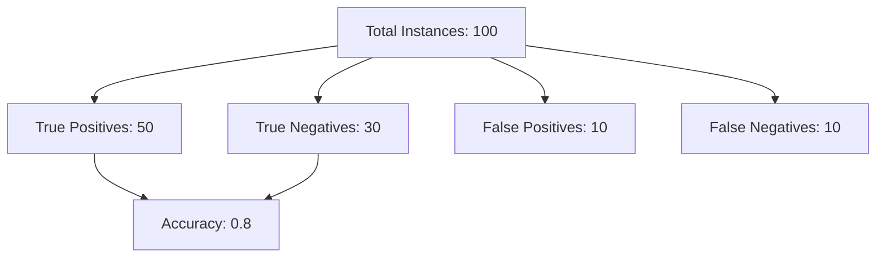
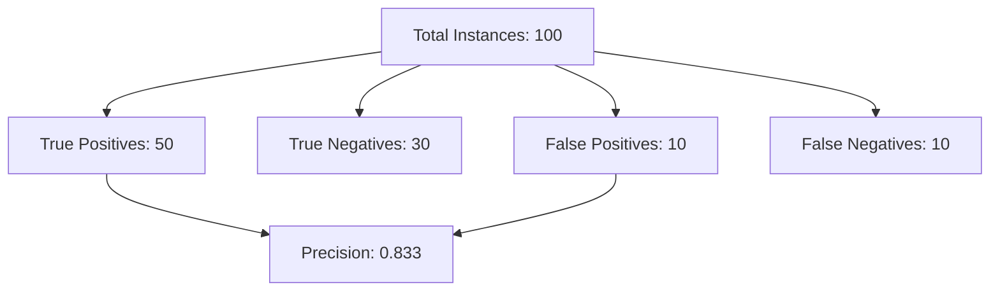
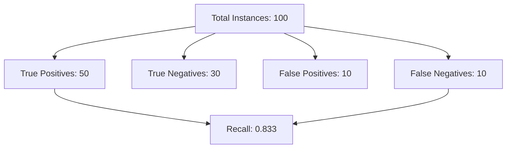
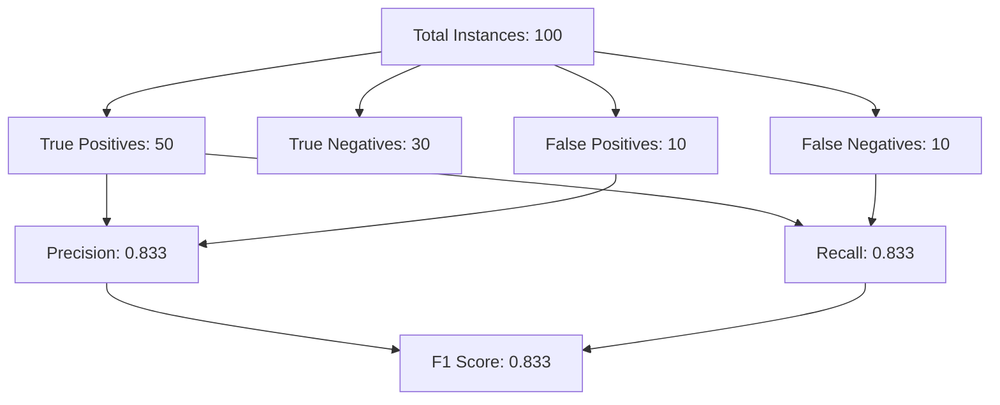
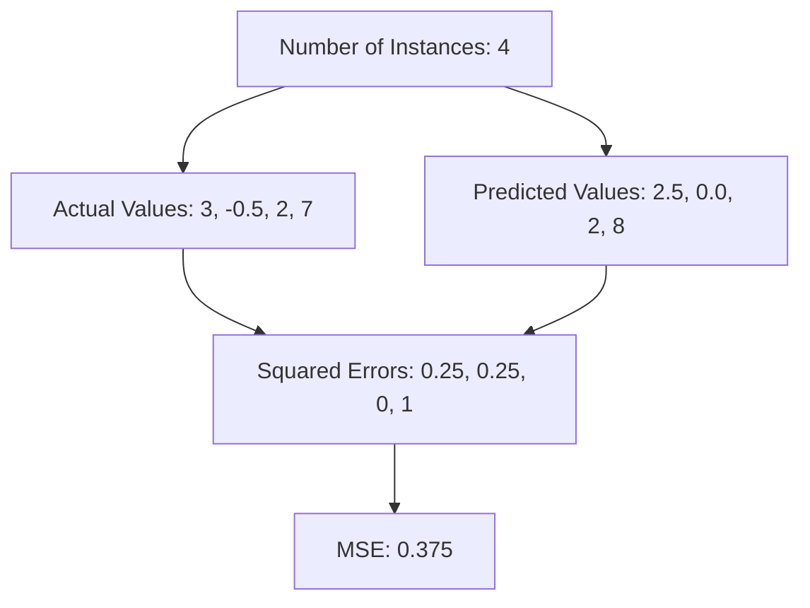
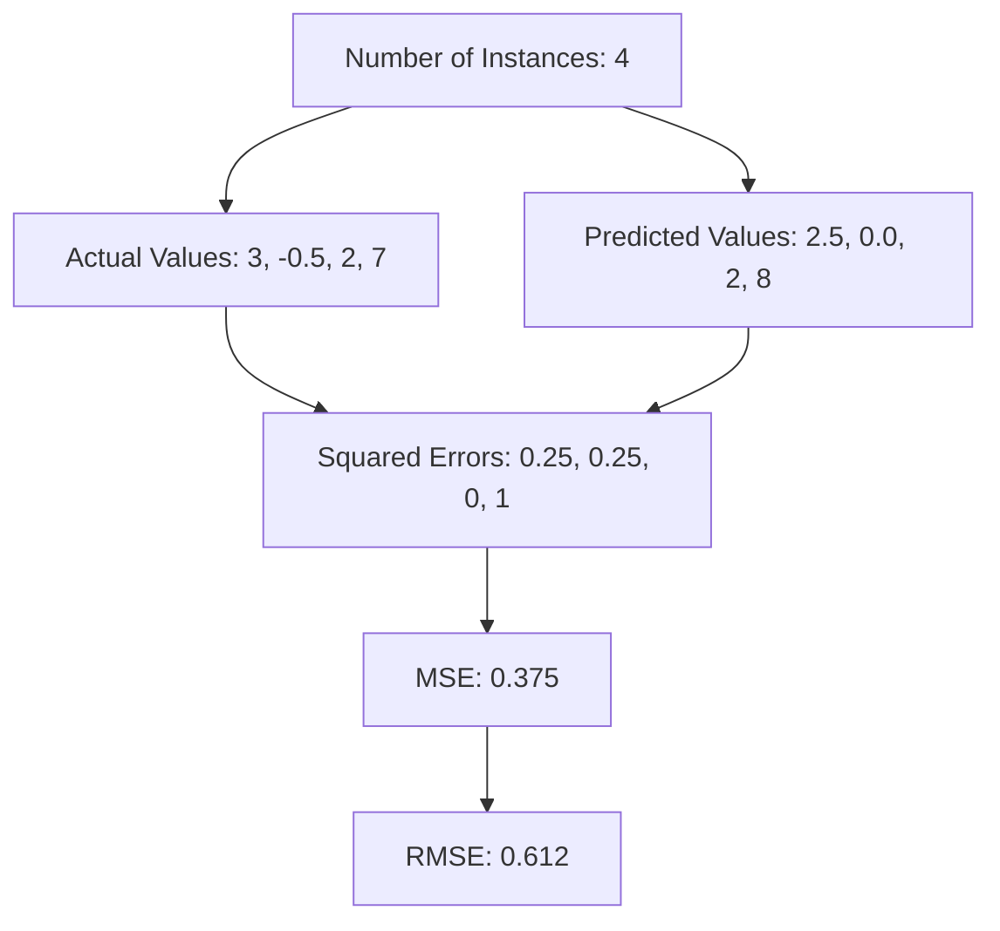
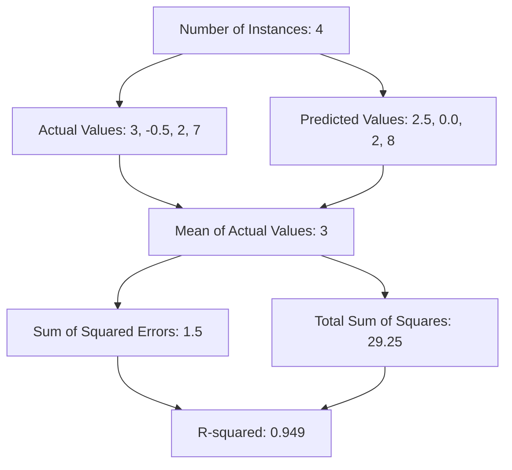
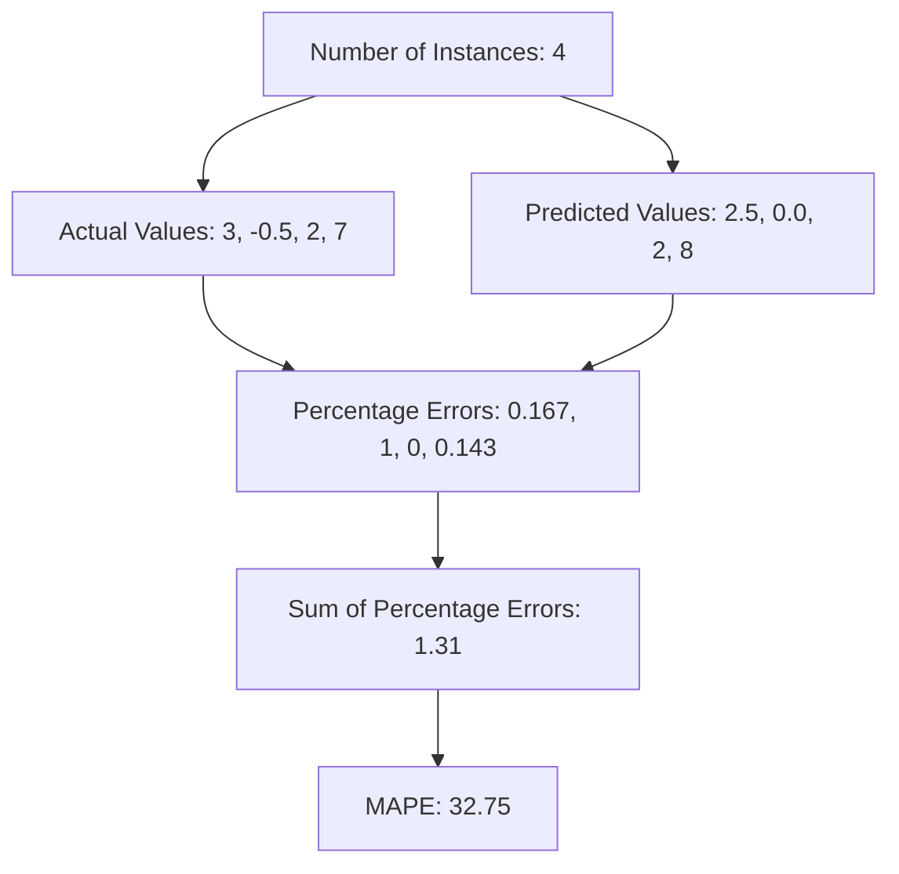

---
{"dg-publish":true,"permalink":"/evaluating-machine-learning-models/","tags":["evaluation","metrics"],"noteIcon":"2","updated":"2024-05-24T15:26:53.324+05:30"}
---

Evaluating machine learning models involves using various metrics to understand their performance. Here are some common evaluation metrics along with simple explanations and visual examples using Mermaid diagrams.

## Evaluation Metrics

### Classification

<a class="markdown-embed-link" href="/evaluating-classification-models/" aria-label="Open link"><svg xmlns="http://www.w3.org/2000/svg" width="24" height="24" viewBox="0 0 24 24" fill="none" stroke="currentColor" stroke-width="2" stroke-linecap="round" stroke-linejoin="round" class="svg-icon lucide-link"><path d="M10 13a5 5 0 0 0 7.54.54l3-3a5 5 0 0 0-7.07-7.07l-1.72 1.71"></path><path d="M14 11a5 5 0 0 0-7.54-.54l-3 3a5 5 0 0 0 7.07 7.07l1.71-1.71"></path></svg></a>

# Classification

## Accuracy

Accuracy measures the proportion of correctly predicted instances out of the total instances. It is calculated as:

$ \text{Accuracy} = \frac{\text{True Positives (TP)} + \text{True Negatives (TN)}}{\text{Total Instances}} $

**Example:**

- True Positives (TP): 50
- True Negatives (TN): 30
- False Positives (FP): 10
- False Negatives (FN): 10
- Total Instances: 100

$ \text{Accuracy} = \frac{50 + 30}{100} = 0.8 $

**Mermaid Diagram:**

## Precision

Precision measures the proportion of correctly predicted positive instances out of the total predicted positive instances. It is calculated as:

$ \text{Precision} = \frac{\text{True Positives (TP)}}{\text{True Positives (TP)} + \text{False Positives (FP)}} $

**Example:**

- True Positives (TP): 50
- True Negatives (TN): 30
- False Positives (FP): 10
- False Negatives (FN): 10
- Total Instances: 100

$ \text{Precision} = \frac{50}{50 + 10} = 0.833 $

**Mermaid Diagram:**

## Recall

Recall measures the proportion of correctly predicted positive instances out of the actual positive instances. It is calculated as:

$ \text{Recall} = \frac{\text{True Positives (TP)}}{\text{True Positives (TP)} + \text{False Negatives (FN)}} $

**Example:**

- True Positives (TP): 50
- True Negatives (TN): 30
- False Positives (FP): 10
- False Negatives (FN): 10
- Total Instances: 100

$ \text{Recall} = \frac{50}{50 + 10} = 0.833 $

**Mermaid Diagram:**

## F1 Score

The F1 Score is the harmonic mean of Precision and Recall. It is calculated as:

$ \text{F1 Score} = 2 \times \frac{\text{Precision} \times \text{Recall}}{\text{Precision} + \text{Recall}} $

**Example:**

- True Positives (TP): 50
- True Negatives (TN): 30
- False Positives (FP): 10
- False Negatives (FN): 10
- Total Instances: 100

From the previous calculations:
- Precision: 0.833
- Recall: 0.833

$ \text{F1 Score} = 2 \times \frac{0.833 \times 0.833}{0.833 + 0.833} = 0.833 $

**Mermaid Diagram:**

## [[Evaluating Machine Learning Models#^bd6d42\|Confusion Matrix]]

A confusion matrix is a table that is often used to describe the performance of a classification model. It includes the following:

- True Positives (TP)
- True Negatives (TN)
- False Positives (FP)
- False Negatives (FN)

**Example:**

- True Positives (TP): 50
- True Negatives (TN): 30
- False Positives (FP): 10
- False Negatives (FN): 10
- Total Instances: 100

**Confusion Matrix:** 
|                     | Predicted Positive | Predicted Negative |
|---------------------|--------------------|--------------------|
| **Actual Positive** | TP = 50            | FN = 10            |
| **Actual Negative** | FP = 10            | TN = 30            |

## Additional Metrics

Other metrics include:

- **ROC-AUC**: Measures the area under the Receiver Operating Characteristic curve. It shows the trade-off between sensitivity (recall) and specificity.
- **Specificity**: Measures the proportion of correctly predicted negative instances out of the actual negative instances.

---

## When to Use Each Metric

- **Accuracy**: Use when the classes are balanced. It is a simple metric but can be *misleading* if the *dataset is imbalanced*.
- **Precision**: Use when the *cost of false positives is high*. For example, in spam detection, you want to minimize the number of legitimate emails marked as spam.
- **Recall**: Use when the cost of *false negatives is high.* For example, in disease screening, you want to catch as many cases as possible.
- **F1 Score**: Use when you need a balance between precision and recall. It is especially useful in *imbalanced datasets*.
- **ROC-AUC**: Use to evaluate the overall performance of the model, especially in *binary classification problems*.
- **Specificity**: Use alongside recall to understand the performance of the model in *identifying negative instances*.

These metrics help evaluate the performance of machine learning models from different perspectives, ensuring a comprehensive understanding of their strengths and weaknesses.

---

## Resources

📚 [**Accuracy, Precision, Recall or F1?**](https://towardsdatascience.com/accuracy-precision-recall-or-f1-331fb37c5cb9)

📚 [**Calculate Precision, Recall and F1 score for Keras model**](https://androidkt.com/precision-recall-and-f1/#:~:text=Compute%20Precision%2C%20Recall%2C%20F1%20score%20for%20each%20epoch.&text=Keras%20allows%20us%20to%20access,to%20compute%20the%20desired%20quantities.&text=Above%20code%20compute%20Precision%2C%20Recall,using%20the%20whole%20validation%20data.)

📚 [**TensorFlow Keras Confusion Matrix in TensorBoard**](https://androidkt.com/keras-confusion-matrix-in-tensorboard/)

### Confusion Matrix

<iframe src="https://www.youtube.com/embed/Kdsp6soqA7o?list=PLblh5JKOoLUICTaGLRoHQDuF_7q2GfuJF" allow="fullscreen" allowfullscreen="" style="height:100%;width:100%; aspect-ratio: 16 / 9; "></iframe>

### Sensitivity and Specificity

<iframe src="https://www.youtube.com/embed/vP06aMoz4v8?list=PLblh5JKOoLUICTaGLRoHQDuF_7q2GfuJF" allow="fullscreen" allowfullscreen="" style="height:100%;width:100%; aspect-ratio: 16 / 9; "></iframe>

### Regression

<a class="markdown-embed-link" href="/evaluating-regression-models/" aria-label="Open link"><svg xmlns="http://www.w3.org/2000/svg" width="24" height="24" viewBox="0 0 24 24" fill="none" stroke="currentColor" stroke-width="2" stroke-linecap="round" stroke-linejoin="round" class="svg-icon lucide-link"><path d="M10 13a5 5 0 0 0 7.54.54l3-3a5 5 0 0 0-7.07-7.07l-1.72 1.71"></path><path d="M14 11a5 5 0 0 0-7.54-.54l-3 3a5 5 0 0 0 7.07 7.07l1.71-1.71"></path></svg></a>

# Regression

Evluating regression models involves different metrics compared to classification models. These metrics help understand the model's performance in predicting continuous values. Here are some common regression evaluation metrics along with simple explanations and visual examples using Mermaid diagrams.

## Mean Absolute Error (MAE)

MAE measures the average absolute differences between the predicted and actual values. It is calculated as:

$ \text{MAE} = \frac{1}{n} \sum_{i=1}^{n} | y_i - \hat{y_i} | $

**Example:**

- Actual Values: [3, -0.5, 2, 7]
- Predicted Values: [2.5, 0.0, 2, 8]
- Number of Instances (n): 4

$ \text{MAE} = \frac{|3 - 2.5| + |-0.5 - 0.0| + |2 - 2| + |7 - 8|}{4} = \frac{0.5 + 0.5 + 0 + 1}{4} = 0.5 $

**Mermaid Diagram:**

## Mean Squared Error (MSE)

MSE measures the average squared differences between the predicted and actual values. It is calculated as:

$ \text{MSE} = \frac{1}{n} \sum_{i=1}^{n} ( y_i - \hat{y_i} )^2 $

**Example:**

- Actual Values: [3, -0.5, 2, 7]
- Predicted Values: [2.5, 0.0, 2, 8]
- Number of Instances (n): 4

$ \text{MSE} = \frac{(3 - 2.5)^2 + (-0.5 - 0.0)^2 + (2 - 2)^2 + (7 - 8)^2}{4} = \frac{0.25 + 0.25 + 0 + 1}{4} = 0.375 $

**Mermaid Diagram:**

## Root Mean Squared Error (RMSE)

RMSE is the square root of the average squared differences between the predicted and actual values. It is calculated as:

$ \text{RMSE} = \sqrt{\frac{1}{n} \sum_{i=1}^{n} ( y_i - \hat{y_i} )^2} $

**Example:**

- Actual Values: [3, -0.5, 2, 7]
- Predicted Values: [2.5, 0.0, 2, 8]
- Number of Instances ($n$): 4

$ \text{RMSE} = \sqrt{\frac{(3 - 2.5)^2 + (-0.5 - 0.0)^2 + (2 - 2)^2 + (7 - 8)^2}{4}} = \sqrt{0.375} \approx 0.612 $

**Mermaid Diagram:**

## R-squared (R²)

R-squared measures the **proportion of the variance in the dependent variable that is predictable from the independent variables**. It is calculated as:

$ R^2 = 1 - \frac{\sum_{i=1}^{n} ( y_i - \hat{y_i} )^2}{\sum_{i=1}^{n} ( y_i - \bar{y} )^2} $

Where $\bar{y}$​ is the **mean** of the actual values.

**Example:**

- Actual Values: [3, -0.5, 2, 7]
- Predicted Values: [2.5, 0.0, 2, 8]
- Mean of Actual Values ($\bar{y}$): **3**

$ R^2 = 1 - \frac{(3 - 2.5)^2 + (-0.5 - 0.0)^2 + (2 - 2)^2 + (7 - 8)^2}{(3 - 3)^2 + (-0.5 - 3)^2 + (2 - 3)^2 + (7 - 3)^2} = 1 - \frac{0.25 + 0.25 + 0 + 1}{0 + 12.25 + 1 + 16} = 1 - \frac{1.5}{29.25} \approx 0.949 $

**Mermaid Diagram:**

## Adjusted R-squared

Adjusted R-squared is a statistical metric that adjusts the R-squared value to account for the number of predictors in a regression model. It is particularly useful when comparing models with different numbers of predictors or when evaluating the impact of adding or removing predictors from a model.

In simple terms, **Adjusted R-squared helps in understanding whether adding more predictors to the model improves its predictive power significantly or not, considering the risk of overfitting**.

Let's revisit the previous example and explain why Adjusted R-squared is required:

Suppose we have a regression model with the following data:
- Actual Values: [3, -0.5, 2, 7]
- Predicted Values: [2.5, 0.0, 2, 8]
- Mean of Actual Values ($\bar{y}$): 3
- Number of Observations ($n$): 4
- Number of Predictors ($k$): 2 (assuming a simple linear regression model with two independent variables)

The standard R-squared ($R^2$) measures the proportion of the variance in the dependent variable (actual values) that is explained by the independent variables (predicted values). In our example, let's say we calculated $( R^2 \approx 0.949)$, indicating that around 94.9% of the variance in the actual values is explained by the model.

However, R-squared has a limitation. It tends to increase with the addition of more predictors, regardless of whether those predictors actually improve the model's predictive power. This can lead to overestimation of the model's performance, especially when including irrelevant variables.

Adjusted R-squared addresses this limitation by penalizing the addition of unnecessary predictors. It takes into account both the goodness of fit (captured by $(R^2)$) and the number of predictors in the model $( k )$. The formula for Adjusted R-squared is:

$\text{Adjusted R}^2 = 1 - \frac{(1 - R^2)(n - 1)}{n - k - 1}$

Here's why Adjusted R-squared is required:
1. **Controls for Model Complexity**: Adjusted R-squared penalizes the inclusion of more predictors, ensuring that the model's improvement in predictive power justifies the added complexity.
2. **Prevents Overfitting**: By penalizing unnecessary predictors, Adjusted R-squared helps prevent overfitting, where the model performs well on training data but poorly on new, unseen data.
3. **Facilitates Model Comparison**: When comparing models with different numbers of predictors, Adjusted R-squared provides a fair comparison by considering both goodness of fit and model simplicity.

Iour example, let's say we calculated Adjusted R-squared $\text{Adjusted R}^2 \approx 0.898$. This value is slightly lower than the standard R-squared, indicating that although the model explains a significant portion of the variance, the addition of predictors might not have provided a substantial improvement in predictive power considering the model's complexity.

## Mean Absolute Percentage Error (MAPE)

MAPE measures the average absolute percentage error between the predicted and actual values. It is calculated as:

$ \text{MAPE} = \frac{100}{n} \sum_{i=1}^{n} \left| \frac{y_i - \hat{y_i}}{y_i} \right| $

**Example:**

- Actual Values: [3, -0.5, 2, 7]
- Predicted Values: [2.5, 0.0, 2, 8]
- Number of Instances (n): 4

$ \text{MAPE} = \frac{100}{4} \left( \left| \frac{3 - 2.5}{3} \right| + \left| \frac{-0.5 - 0.0}{-0.5} \right| + \left| \frac{2 - 2}{2} \right| + \left| \frac{7 - 8}{7} \right| \right) = \frac{100}{4} (0.167 + 1 + 0 + 0.143) = \frac{100}{4} (1.31) = 32.75 $

**Mermaid Diagram:**

## When to Use Each Metric

- **MAE**: Use when you want to measure the average magnitude of errors in predictions without considering their direction. It is more interpretable in the same unit as the predicted values.
- **MSE**: Use when you want to penalize larger errors more severely, as squaring the errors gives more weight to larger errors. 
- **RMSE**: Use when you want to measure the standard deviation of the errors. It provides a sense of how spread out the errors are.
- **R-squared**: Use when you want to understand the proportion of variance in the dependent variable explained by the independent variables. 
- **MAPE**: Use when you want to understand the error in percentage terms, which is useful for comparing model performance across different scales.

These metrics help evaluate the performance of regression models from different perspectives, ensuring a comprehensive understanding of their strengths and weaknesses.

---

## Resources

### R Squared

<iframe title="R Squared Explained in 5 minutes" src="https://www.youtube.com/embed/-7U10N8PvlQ?start=207&amp;feature=oembed" height="113" width="200" allowfullscreen="" allow="fullscreen" style="aspect-ratio: 1.76991 / 1; width: 100%; height: 100%;"></iframe>

### Adjust R Squared

> [!tip] Watch from 8:15

<iframe title="R squared and Adjusted R squared Explained" src="https://www.youtube.com/embed/Mo64VgUJOpA?start=606&amp;feature=oembed" height="113" width="200" allowfullscreen="" allow="fullscreen" style="aspect-ratio: 1.76991 / 1; width: 100%; height: 100%;"></iframe>

