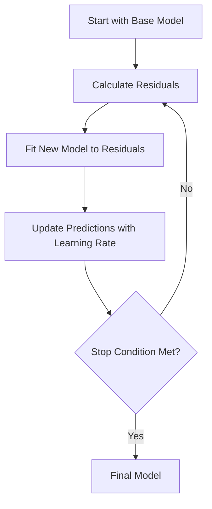

---
{"dg-publish":true,"permalink":"/gradient-boosting/","tags":["boosting","ensemble-learning","trees","traditional-ml"],"noteIcon":"2","updated":"2024-05-24T17:23:08.768+05:30"}
---

## Explanation of Gradient Boosting

Gradient Boosting is a machine learning technique used for regression and classification problems. It builds a model in a stage-wise fashion, like other boosting methods, and it generalizes them by allowing optimization of an arbitrary differentiable loss function.

Here's a simple explanation:

1. **Start with a base model:** Begin with a simple model, often called the base model (e.g., a decision tree with one node).

2. **Calculate residuals:** Compute the difference (residuals) between the actual values and the predictions of the base model.

3. **Fit a new model to residuals:** Create a new model to predict the residuals.

4. **Add the new model to the base model:** Adjust the base model by adding the predictions from the new model, scaled by a learning rate.

5. **Repeat:** Continue this process for a specified number of iterations or until the residuals are minimized.

## Learning Rate

The learning rate is a scaling factor applied to the predictions of each new model before adding them to the ensemble. **It controls the contribution of each model to the final prediction**. A smaller learning rate means more models (iterations) are needed, which can lead to better generalization, while a larger learning rate might lead to faster convergence but potentially overfitting.

## Example

Imagine you're trying to predict the price of houses based on their size.

1. **Base Model:** Start with a simple prediction, like the average price.
2. **Residuals:** Calculate how far off these predictions are from the actual prices.
3. **New Model:** Fit a new decision tree to predict these residuals.
4. **Update Prediction:** Adjust the initial prediction by adding the new model's predictions (scaled by the learning rate).
5. **Iterate:** Repeat the process, fitting new models to the residuals of the updated predictions.

## Mermaid Diagram

Here's a mermaid diagram to visualize the process:

## Diagram Explanation

1. **Start with Base Model:** This is your initial simple model.
2. **Calculate Residuals:** Compute the errors (residuals) from the initial predictions.
3. **Fit New Model to Residuals:** Train a new model to predict these errors.
4. **Update Predictions with Learning Rate:** Adjust the base model's predictions by adding the new model's predictions, scaled by the learning rate.
5. **Stop Condition:** Check if the stop condition (e.g., number of iterations) is met.
6. **Final Model:** Once the stop condition is met, the ensemble of models constitutes the final model.

This iterative process helps to minimize the residuals and improve the accuracy of the predictions by combining the strengths of multiple models.

<iframe src="https://www.youtube.com/embed/3CC4N4z3GJc?list=PLblh5JKOoLUJjeXUvUE0maghNuY2_5fY6" height="113" width="200" allowfullscreen="" allow="fullscreen" style="aspect-ratio: 1.76991 / 1; width: 100%; height: 100%;"></iframe>
