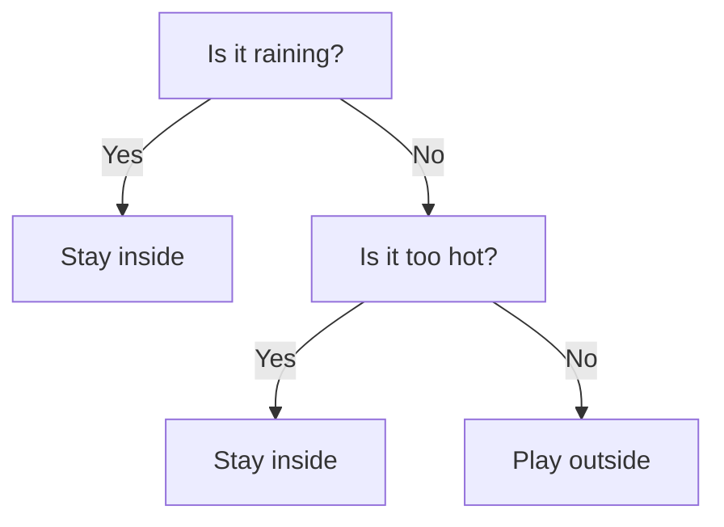
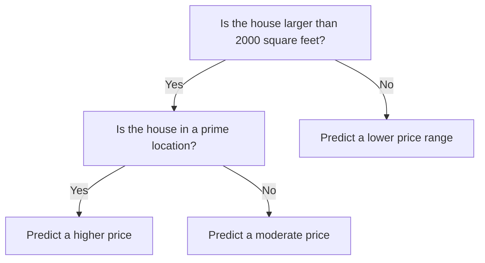

---
{"dg-publish":true,"permalink":"/tree-based-algorithms/"}
---

## Decision Trees

A decision tree is like a flowchart that helps you make decisions. Imagine you want to decide whether to play outside. You ask a series of questions, and each answer leads to another question or a decision. For example:

1. **Is it raining?**
    - Yes: **Stay inside**
    - No: Go to the next question.
2. **Is it too hot?**
    - Yes: **Stay inside**
    - No: **Play outside**

In a decision tree, you start from the top (the root), ask questions (nodes), and follow the branches based on the answers until you reach a decision (leaf).

## Regression Trees

A regression tree is similar to a decision tree but is used for predicting numerical values instead of making categorical decisions. Imagine you want to predict the price of a house. You ask questions about the house's features, like its size, location, and age. Each question helps narrow down the price range. For example:

1. **Is the house larger than 2000 square feet?**
    - Yes: Go to the next question.
    - No: Predict a lower price range.
2. **Is the house in a prime location?**
    - Yes: Predict a higher price.
    - No: Predict a moderate price.

In a regression tree, each path from the root to a leaf represents a set of conditions that lead to a predicted numerical value.

## Resources

### StatQuest Videos, Very Simple Explanation. Great for Building Intuition.

**Questions answered**:
- Classification tree
- Regression tree
- Pruning
- Very good walk-through (**detailed**!) using a notebook using Decision tree classification.

<iframe src="https://www.youtube.com/embed/videoseries?si=7XG8zmdWMriKBD7Q&amp;list=PLblh5JKOoLUKAtDViTvRGFpphEc24M-QH" allow="fullscreen" allowfullscreen="" style="height:auto;width:100%; aspect-ratio: 16 / 9; "></iframe>

---

### Even Better Video with Code. By **Google** and Associated [[Google Colab\|Google Colab]]

**Questions answered**: 
- What is a classification tree?
- How does a tree learn?
- Seeing how to make splits and selecting nodes via code.
- What is information gain?
- What is Gini impurity?

<iframe title="Let’s Write a Decision Tree Classifier from Scratch - Machine Learning Recipes #8" src="https://www.youtube.com/embed/LDRbO9a6XPU?feature=oembed" height="113" width="200" allowfullscreen="" allow="fullscreen" style="aspect-ratio: 1.76991 / 1; width: 100%; height: auto;"></iframe>

---

### A Little More Challenging but with **great visualizations**

I guess it's safe to ignore the python coding videos since all of these algorithms are available in libraries like [[Scikit-learn\|Scikit-learn]].

**Fantastic** explanation of **Random Forests** and why they are needed over simple **Decision Trees**.

Also explains [[Ensemble Learning\|Bootstrapping and Bagging]] and Random Feature Selection and why they are necessary.

<iframe src="https://www.youtube.com/embed/videoseries?si=bzya7BF4BA_RTWDt&amp;list=PLM8wYQRetTxAl5FpMIJCcJbfZjSB0IeC_" allow="fullscreen" allowfullscreen="" style="height:100%;width:100%; aspect-ratio: 16 / 9; "></iframe>

---

## Explore [[Ensemble Learning\|Ensemble Learning]] after Learning Tree-based Algorithms!
