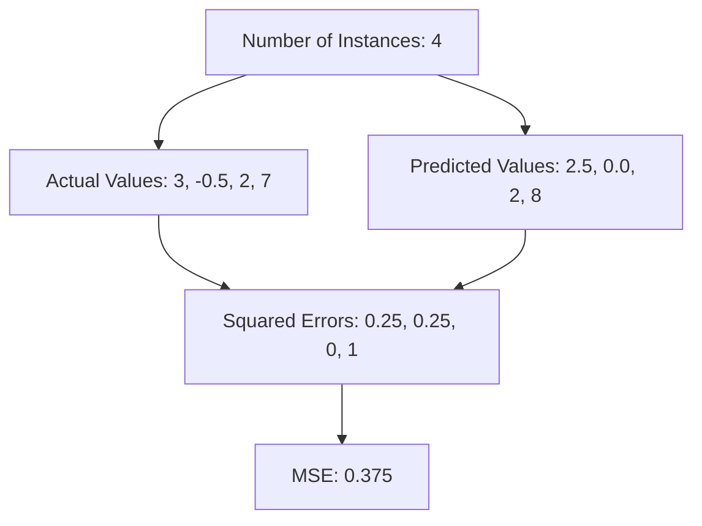
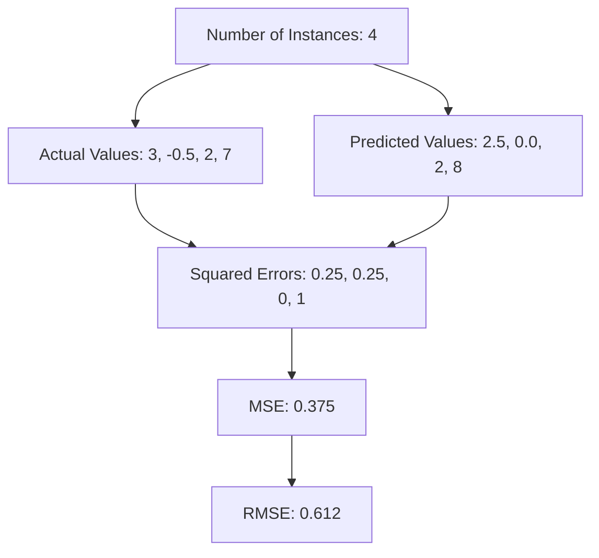
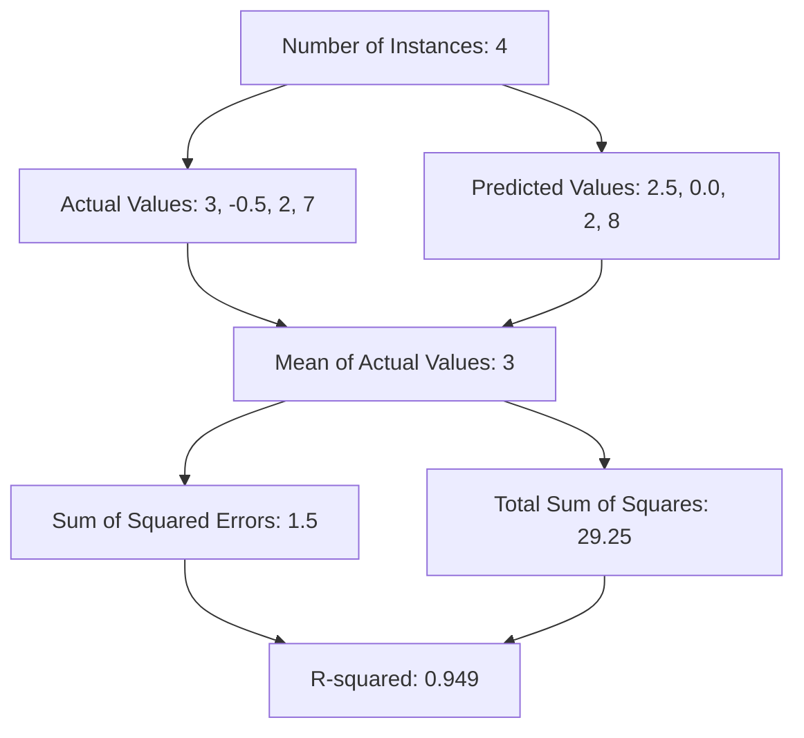
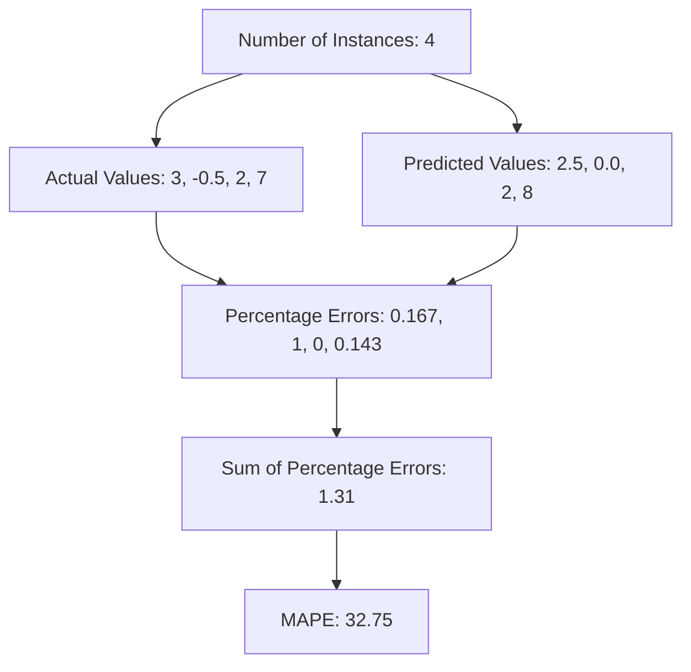

---
{"dg-publish":true,"permalink":"/ml-fundamentals/evaluating-regression-models/","tags":["evaluation","metrics","regression"],"noteIcon":"2","updated":"2024-05-24T15:47:01.854+05:30"}
---

Evaluating regression models involves different metrics compared to classification models. These metrics help understand the model's performance in predicting continuous values. Here are some common regression evaluation metrics along with simple explanations and visual examples using Mermaid diagrams.

## Evaluation Metrics

- [[🧒 ML Fundamentals/Evaluating Regression Models#Mean Absolute Error (MAE)\|#Mean Absolute Error (MAE)]]
- [[🧒 ML Fundamentals/Evaluating Regression Models#Mean Squared Error (MSE)\|#Mean Squared Error (MSE)]]
- [[🧒 ML Fundamentals/Evaluating Regression Models#Root Mean Squared Error (RMSE)\|#Root Mean Squared Error (RMSE)]]
- [[🧒 ML Fundamentals/Evaluating Regression Models#R-squared (R²)\|#R-squared (R²)]]
- [[🧒 ML Fundamentals/Evaluating Regression Models#Adjusted R-squared\|#Adjusted R-squared]]
- [[🧒 ML Fundamentals/Evaluating Regression Models#Mean Absolute Percentage Error (MAPE)\|#Mean Absolute Percentage Error (MAPE)]]

## Mean Absolute Error (MAE)

MAE measures the average absolute differences between the predicted and actual values. It is calculated as:

$$ \text{MAE} = \frac{1}{n} \sum_{i=1}^{n} | y_i - \hat{y_i} | $$

**Example:**

- Actual Values: [3, -0.5, 2, 7]
- Predicted Values: [2.5, 0.0, 2, 8]
- Number of Instances (n): 4

$$ \text{MAE} = \frac{|3 - 2.5| + |-0.5 - 0.0| + |2 - 2| + |7 - 8|}{4} = \frac{0.5 + 0.5 + 0 + 1}{4} = 0.5 $$

**Mermaid Diagram:**

## Mean Squared Error (MSE)

MSE measures the average squared differences between the predicted and actual values. It is calculated as:

$$ \text{MSE} = \frac{1}{n} \sum_{i=1}^{n} ( y_i - \hat{y_i} )^2 $$

**Example:**

- Actual Values: [3, -0.5, 2, 7]
- Predicted Values: [2.5, 0.0, 2, 8]
- Number of Instances (n): 4

$$ \text{MSE} = \frac{(3 - 2.5)^2 + (-0.5 - 0.0)^2 + (2 - 2)^2 + (7 - 8)^2}{4} = \frac{0.25 + 0.25 + 0 + 1}{4} = 0.375 $$

**Mermaid Diagram:**

## Root Mean Squared Error (RMSE)

RMSE is the square root of the average squared differences between the predicted and actual values. It is calculated as:

$$ \text{RMSE} = \sqrt{\frac{1}{n} \sum_{i=1}^{n} ( y_i - \hat{y_i} )^2} $$

**Example:**

- Actual Values: [3, -0.5, 2, 7]
- Predicted Values: [2.5, 0.0, 2, 8]
- Number of Instances (n): 4

$$ \text{RMSE} = \sqrt{\frac{(3 - 2.5)^2 + (-0.5 - 0.0)^2 + (2 - 2)^2 + (7 - 8)^2}{4}} = \sqrt{0.375} \approx 0.612 $$

**Mermaid Diagram:**

**Root Mean Squared Error (RMSE)**:

- Measures the **average magnitude of the errors between predicted and observed values**.
- Lower values indicate better model performance, as the errors are smaller.
- There is no definitive range for "good" or "bad" RMSE values, as it depends on the scale and units of the target variable.
- Generally, lower RMSE values are better, with very low values indicating excellent model performance.

## R-squared (R²)

R-squared measures the **proportion of the variance in the dependent variable that is predictable from the independent variables**. It is calculated as:

$$ R^2 = 1 - \frac{\sum_{i=1}^{n} ( y_i - \hat{y_i} )^2}{\sum_{i=1}^{n} ( y_i - \bar{y} )^2} $$

Where $\bar{y}$​ is the **mean** of the actual values.

**Example:**

- Actual Values: [3, -0.5, 2, 7]
- Predicted Values: [2.5, 0.0, 2, 8]
- Mean of Actual Values ($\bar{y}$): **3**

$$ R^2 = 1 - \frac{(3 - 2.5)^2 + (-0.5 - 0.0)^2 + (2 - 2)^2 + (7 - 8)^2}{(3 - 3)^2 + (-0.5 - 3)^2 + (2 - 3)^2 + (7 - 3)^2} = 1 - \frac{0.25 + 0.25 + 0 + 1}{0 + 12.25 + 1 + 16} = 1 - \frac{1.5}{29.25} \approx 0.949 $$

**Mermaid Diagram:**

Here's a markdown table with a range of values for R-squared and Root Mean Squared Error (RMSE) and how they are typically interpreted for machine learning models:

| R-squared | Interpretation | RMSE            | Interpretation                   |
| --------- | -------------- | --------------- | -------------------------------- |
| 0.0 - 0.3 | Very poor fit  | High values     | Poor model performance           |
| 0.3 - 0.5 | Poor fit       | Moderate values | Moderate model performance       |
| 0.5 - 0.7 | Moderate fit   | Low values      | Good model performance           |
| 0.7 - 0.9 | Good fit       | Very low values | Excellent model performance      |
| 0.9 - 1.0 | Excellent fit  | ~ 0             | Perfect model performance (rare) |

## Adjusted R-squared

Adjusted R-squared is a statistical metric that adjusts the R-squared value to account for the number of predictors in a regression model. It is particularly useful when comparing models with different numbers of predictors or when evaluating the impact of adding or removing predictors from a model.

In simple terms, **Adjusted R-squared helps in understanding whether adding more predictors to the model improves its predictive power significantly or not, considering the risk of overfitting**.

Let's revisit the previous example and explain why Adjusted R-squared is required:

Suppose we have a regression model with the following data:
- Actual Values: [3, -0.5, 2, 7]
- Predicted Values: [2.5, 0.0, 2, 8]
- Mean of Actual Values ($\bar{y}$): 3
- Number of Observations ($n$): 4
- Number of Predictors ($k$): 2 (assuming a simple linear regression model with two independent variables)

The standard R-squared ($R^2$) measures the proportion of the variance in the dependent variable (actual values) that is explained by the independent variables (predicted values). In our example, let's say we calculated $( R^2 \approx 0.949)$, indicating that around 94.9% of the variance in the actual values is explained by the model.

However, R-squared has a limitation. It tends to increase with the addition of more predictors, regardless of whether those predictors actually improve the model's predictive power. This can lead to overestimation of the model's performance, especially when including irrelevant variables.

Adjusted R-squared addresses this limitation by penalizing the addition of unnecessary predictors. It takes into account both the goodness of fit (captured by $(R^2)$) and the number of predictors in the model $( k )$. The formula for Adjusted R-squared is:

$$\text{Adjusted R}^2 = 1 - \frac{(1 - R^2)(n - 1)}{n - k - 1}$$

Here's why Adjusted R-squared is required:
1. **Controls for Model Complexity**: Adjusted R-squared penalizes the inclusion of more predictors, ensuring that the model's improvement in predictive power justifies the added complexity.
2. **Prevents Overfitting**: By penalizing unnecessary predictors, Adjusted R-squared helps prevent overfitting, where the model performs well on training data but poorly on new, unseen data.
3. **Facilitates Model Comparison**: When comparing models with different numbers of predictors, Adjusted R-squared provides a fair comparison by considering both goodness of fit and model simplicity.

Iour example, let's say we calculated Adjusted R-squared $\text{Adjusted R}^2 \approx 0.898$. This value is slightly lower than the standard R-squared, indicating that although the model explains a significant portion of the variance, the addition of predictors might not have provided a substantial improvement in predictive power considering the model's complexity.

## Mean Absolute Percentage Error (MAPE)

MAPE measures the average absolute percentage error between the predicted and actual values. It is calculated as:

$$ \text{MAPE} = \frac{100}{n} \sum_{i=1}^{n} \left| \frac{y_i - \hat{y_i}}{y_i} \right| $$

**Example:**

- Actual Values: [3, -0.5, 2, 7]
- Predicted Values: [2.5, 0.0, 2, 8]
- Number of Instances (n): 4

$$ \text{MAPE} = \frac{100}{4} \left( \left| \frac{3 - 2.5}{3} \right| + \left| \frac{-0.5 - 0.0}{-0.5} \right| + \left| \frac{2 - 2}{2} \right| + \left| \frac{7 - 8}{7} \right| \right) = \frac{100}{4} (0.167 + 1 + 0 + 0.143) = \frac{100}{4} (1.31) = 32.75 $$

**Mermaid Diagram:**

## When to Use Each Metric

- **MAE**: Use when you want to measure the average magnitude of errors in predictions without considering their direction. It is more interpretable in the same unit as the predicted values.
- **MSE**: Use when you want to penalize larger errors more severely, as squaring the errors gives more weight to larger errors. 
- **RMSE**: Use when you want to measure the standard deviation of the errors. It provides a sense of how spread out the errors are.
- **R-squared**: Use when you want to understand the proportion of variance in the dependent variable explained by the independent variables. 
- **MAPE**: Use when you want to understand the error in percentage terms, which is useful for comparing model performance across different scales.

These metrics help evaluate the performance of regression models from different perspectives, ensuring a comprehensive understanding of their strengths and weaknesses.

---

## Resources

### R Squared

<iframe title="R Squared Explained in 5 minutes" src="https://www.youtube.com/embed/-7U10N8PvlQ?start=207&amp;feature=oembed" height="113" width="200" allowfullscreen="" allow="fullscreen" style="aspect-ratio: 1.76991 / 1; width: 100%; height: 100%;"></iframe>

### Adjust R Squared

> [!tip] Watch from 8:15

<iframe title="R squared and Adjusted R squared Explained" src="https://www.youtube.com/embed/Mo64VgUJOpA?start=606&amp;feature=oembed" height="113" width="200" allowfullscreen="" allow="fullscreen" style="aspect-ratio: 1.76991 / 1; width: 100%; height: 100%;"></iframe>
